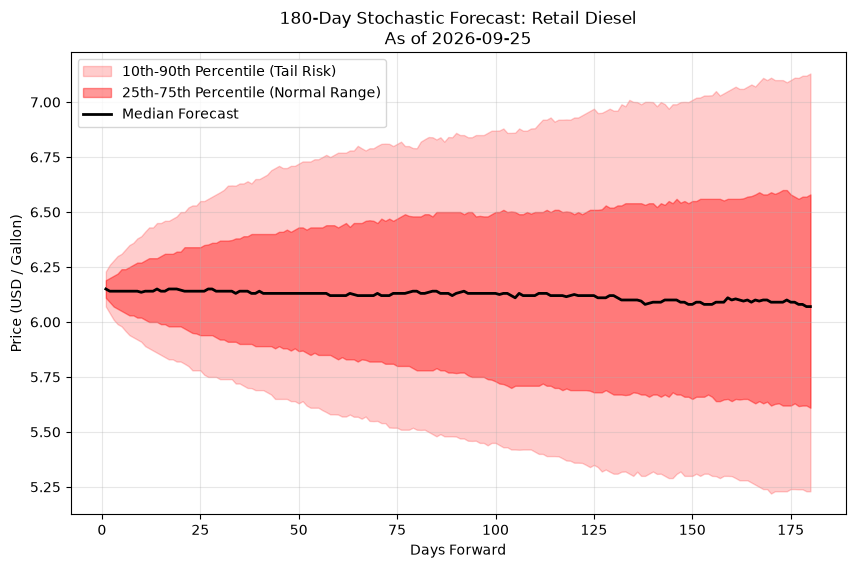

# petroleum-forecasting

Production petroleum stochastic forecast pipeline. The project calibrates a
price model from recent NYMEX futures data, runs parallel Monte Carlo
simulations, and generates forecast charts for retail gasoline and diesel.

## Files

- `calibrate.py` downloads crude, gasoline, and diesel futures data with
  `yfinance`, estimates volatility and crack spread levels, and writes the
  model inputs to `params.json` and `params_macro.json`.
- `simulate.go` reads those calibrations and simulates 2,000 180-day fuel
  paths by default (configurable via `sims` in `params_macro.json`). It now
  includes sovereign production behavior, SPR intervention logic, chokepoint
  freight risk, and seasonal refinery margin effects.
- `report_gen.py` reads the simulation CSVs and creates percentile-band charts:
  `gasoline_forecast.png` and `diesel_forecast.png` with the date stamped in the
  title.
- `run_pipeline.bat` runs calibration, builds and runs the Go simulation,
  generates both charts, and refreshes the scenario what-if report. It stops
  if any step fails.
- `scenario_report.py` runs the simulator once per what-if scenario (Hormuz
  closure, Saudi production cut, Iran sanctions lifted, etc.), then writes a
  Bloomberg-style markdown report (`oil_market_outlook.md`) with scenario
  comparison charts and tables. Run it after `calibrate.py`; it restores
  `params_macro.json` and the standard result CSVs to the base case when it
  finishes, so it does not disturb the normal pipeline outputs. It also reads
  the current national average regular and diesel prices from AAA's public
  gas-prices page and shows them as a dated snapshot in the report. If AAA is
  unavailable or its table changes, report generation fails instead of
  publishing missing or stale retail prices.
- `.gitignore` excludes generated data outputs, the local virtual environment,
  and copied workspace artifacts.

## Requirements

- Windows (the included deployment script is a batch file)
- Python 3.10 or newer
- Go 1.20 or newer
- Internet access when calibration and report generation run, so `yfinance`
  can fetch NYMEX data and the report can read AAA's public gas-prices page

Install the Python dependencies in a virtual environment:

```powershell
py -3 -m venv .venv
.\\.venv\\Scripts\\Activate.ps1
python -m pip install --upgrade pip
python -m pip install numpy pandas matplotlib yfinance requests beautifulsoup4
```

If PowerShell blocks activation, run the commands from Command Prompt instead:

```bat
py -3 -m venv .venv
.venv\\Scripts\\activate.bat
python -m pip install --upgrade pip
python -m pip install numpy pandas matplotlib yfinance requests beautifulsoup4
```

## Run Locally

Run the batch file from the repository directory so all input and output files
are resolved in the expected location:

```bat
run_pipeline.bat
```

Or run the stages individually:

```bat
python calibrate.py
go build simulate.go
simulate.exe
python report_gen.py
python scenario_report.py
```

The default model uses 252 days of calibration data, a 180-day forecast
horizon, and 2,000 simulation paths (set by `sims` in `params_macro.json`;
omit it, or set it to 0, and `simulate.go` falls back to the same 2,000-path
default). Raise it for tighter tail percentiles at the cost of longer run
time, or lower it for faster iteration. Calibration must run before
simulation because `simulate.go` requires the generated `params.json` file.

## Model Logic: How the Variables Interact

This project is no longer a single jump-diffusion crude model. It is a coupled
system of stochastic equations that separates raw commodity pricing from the
real-world constraints that affect retail fuel costs.

### 1. Crude price component (`s0`, `sigma_crude`, `jump_lambda`, `jump_mu`)

- `s0`: the current crude price baseline.
- `sigma_crude`: the volatility of crude returns used in the stochastic price
  driver.
- `jump_lambda`: the expected frequency of large unexpected crude shocks.
- `jump_mu`: the average magnitude of those shocks.

These variables create the underlying crude oil path. In plain English, they
answer: "How expensive is crude today, how quickly can it move, and how often
should we expect surprise jumps?"

### 2. Sovereign production and supply dynamics (`saudi_prod`, `saudi_cap`,
`russia_prod`, `russia_decay`, `venezuela_cap`, `iran_cap`, `iran_prod`,
`us_prod`, `us_cap`, `other_prod`, `other_cap`)

The model treats supply as a constrained system instead of a perfect infinite
supply assumption.

- `saudi_prod`: the baseline Saudi production level.
- `saudi_cap`: maximum Saudi spare capacity; Saudi Arabia acts like a balancing
  producer and can dampen price spikes when it brings more volume online.
- `russia_prod`: current Russian output baseline.
- `russia_decay`: negative drift representing aging wells, sanctions exposure,
  and infrastructure decline.
- `venezuela_cap`: an export ceiling for Venezuela. (Not yet wired into the
  simulation's production dynamics — currently informational only.)
- `iran_cap`: a cap for Iranian supply.
- `iran_prod`: baseline Iranian production. Iran is modeled as
  sanctions-constrained: output drifts slowly toward `iran_cap` and barely
  responds to price, unlike a true swing producer.
- `us_prod` / `us_cap`: baseline and maximum US (shale) production. US output
  behaves like a price-responsive swing producer, but ramps up *above* a
  breakeven price and cuts back below it — the opposite response direction
  from Saudi Arabia — and is bounded by a higher marginal-cost floor that
  reflects existing wells that aren't easily shut in.
- `other_prod` / `other_cap`: an aggregated "rest of world" production
  baseline and ceiling covering all other producing countries, modeled as a
  slow-moving aggregate with mild price elasticity.

These variables determine how much oil is physically available to the market.
The model assumes that the main producers are not interchangeable: Saudi output
acts like a stabilizer, Russia is assumed to decline over time, US shale flexes
with the price cycle, Iran remains sanctioned and largely flat, and the rest of
the world contributes a slow-moving aggregate baseline.

### 3. Seasonality and refining yields (`day_of_year`, `crack_gas_0`,
`crack_diesel_0`, `sigma_crack_gas`, `sigma_crack_diesel`)

Gasoline and diesel do not move in a vacuum; their values depend on seasonal
refining yields and blending rules.

- `day_of_year`: the current day of the year, which drives the seasonal phase.
- `crack_gas_0`: the initial gasoline crack spread baseline.
- `crack_diesel_0`: the initial diesel crack spread baseline.
- `sigma_crack_gas`: volatility of gasoline crack spread movements.
- `sigma_crack_diesel`: volatility of diesel crack spread movements.

Refining margins are not static. Summer gasoline demand and RVP blending rules
can create stronger gasoline cracks, while winter diesel and heating demand can
shift diesel cracks. In the Go model, this is represented as a sinusoidal
seasonal component layered onto the baseline crack spread.

### 4. Freight and maritime chokepoint risk (`freight_0`,
`chokepoint_lambda`, `chokepoint_jump_mu`, `hormuz_rate`, `bab_rate`,
`shipping_cost_0`)

The model separates shipping cost from the commodity itself because the freight
bill is driven by geopolitical risk rather than crude value alone.

- `freight_0`: the baseline tanker freight cost in dollars per barrel.
- `chokepoint_lambda`: the rate at which conflict-driven shipping disruptions are
  expected.
- `chokepoint_jump_mu`: the average extra freight cost added when shipping risk
  spikes.
- `hormuz_rate` / `bab_rate`: the daily oil volume (million barrels per day)
  that normally transits the Strait of Hormuz and Bab el-Mandeb. When a
  disruption event fires, the model picks a strait weighted by relative
  traffic and scales the *severity* of that event — the freight jump, the
  shipping cost jump, and a temporary supply shock all get bigger the busier
  the affected strait normally is.
- `shipping_cost_0`: the baseline war-risk/insurance premium in dollars per
  barrel. Unlike `freight_0`, which represents the physical tanker charter
  cost, `shipping_cost` represents insurance and war-risk surcharges layered
  on top of freight, and it reverts to baseline faster once a disruption
  passes.

A war risk premium or disruption around the Strait of Hormuz or Bab
el-Mandeb can cause a sharp jump in freight and insurance costs even if crude
itself does not move dramatically. This matters because higher freight and
shipping costs can raise delivered retail prices even when the crude
component is stable.

### 5. SPR intervention logic (`spr_trigger_price`, `spr_floor_price`,
`spr_max_draw_mbpd`)

The Strategic Petroleum Reserve is modeled as a policy lever rather than an
abstract damping term.

- `spr_trigger_price`: the crude price threshold at which the U.S. may release
  reserves.
- `spr_floor_price`: the lower price floor below which the U.S. may restock.
- `spr_max_draw_mbpd`: the maximum release rate, in million barrels per day.

When crude prices spike above a trigger threshold, the model can simulate SPR
release and add supply back to the market. When prices fall below a floor,
restocking can become a mild drain on supply.

### 6. Interaction between variables

The model works by coupling the drivers like this:

1. Crude price is driven by stochastic volatility and jump risk.
2. Sovereign production (Saudi, Russia, US shale, Iran, and the rest-of-world
   aggregate) determines physical supply availability and whether the market
   is tight or loose.
3. Freight and chokepoint risk change delivery costs and add market stress;
   the shipping insurance premium adds a second, faster-reverting cost spike
   on top of freight, both scaled by chokepoint throughput.
4. Seasonal crack spreads modify refinery margins and therefore retail fuel
   prices.
5. SPR intervention acts as a policy shock that dampens or amplifies the crude
   price path depending on the price regime.

The final pump price is not just the commodity price. It is the crude price path,
plus refining margin, plus freight, plus the shipping insurance premium, plus
taxes and distribution costs:

`P_t = (S_t + C_t + F_t + I_t) / 42 + D_t + T_t`

That is why a forecast can show lower fuel prices even when local gasoline at the
pump feels expensive today: the forecast is modeling the medium-term path of the
whole chain, not just the immediate station price you see in the moment.

## Outputs

After a successful run, the repository contains:

- `params.json`: legacy market calibration inputs
- `params_macro.json`: sovereign supply, SPR, freight, crack, and seasonal inputs
- `results_gas.csv`: one simulated gasoline path per row
- `results_diesel.csv`: one simulated diesel path per row
- `results_macro_gas.csv`: macro-factor gasoline simulations
- `results_macro_diesel.csv`: macro-factor diesel simulations
- `gasoline_forecast.png`: chart for the gasoline path with the as-of date
- `diesel_forecast.png`: chart for the diesel path with the as-of date

### Diesel Forecast



These generated files are ignored by Git. Keep them locally or publish them to
the reporting location used by your operations process.

### Scenario / What-If Report

`python scenario_report.py` (already included as step 4 of
`run_pipeline.bat`, and runnable on its own after `calibrate.py`) produces a
Bloomberg-analyst-style outlook covering the base case plus six stress
scenarios — Hormuz closure, Hormuz de-risking, a 20% Saudi production cut,
Iran sanctions being lifted, a US shale surge, and a combined Hormuz+Saudi
tail-risk case:

- `oil_market_outlook.md`: the written report, with summary tables, a
  per-scenario breakdown, and a methodology section describing the
  elasticity assumption used to size production shocks.
- `scenario_gasoline_paths.png` / `scenario_diesel_paths.png`: median price
  paths per scenario over the base case's percentile bands.
- `scenario_day180_ranking.png`: a day-180 median price ranking across
  scenarios.

These three chart files and the report are tracked in Git (unlike the daily
pipeline outputs above) since they represent a point-in-time analysis rather
than a disposable daily run.

## Deployment

1. Install Python, Go, and the Python dependencies on the target Windows
   machine.
2. Copy or clone this repository to a stable folder, such as
   `C:\\Apps\\petroleum-forecasting`.
3. Open a terminal in that folder, activate the virtual environment, and run
   `run_pipeline.bat` once to verify network access and permissions.
4. To run it automatically, create a Windows Task Scheduler task with:
   - **Program:** the full path to `run_pipeline.bat`
   - **Start in:** the repository folder
   - **Trigger:** the desired daily schedule, preferably after the market data
     is available
   - **Settings:** enable running whether or not a user is logged on, and save
     the task output or configure a failure notification

The task account must have write access to the repository folder. Because the
batch file calls `python`, `go`, and `git`, those commands must be on that
account's `PATH`; alternatively, update the batch file to use absolute paths
to the virtual-environment Python executable, the Go installation, and Git.

The final pipeline step commits and pushes `oil_market_outlook.md` and its
three chart PNGs straight to `main` if they changed since the last run (it
skips the commit if nothing changed). This requires the repository folder to
be checked out on `main` with push access already working non-interactively
— i.e. an SSH key loaded in an agent, or a credential helper with a cached
token — since a Task Scheduler run cannot prompt for a password. Test this by
running `run_pipeline.bat` manually first and confirming the push succeeds
without a prompt.

This repository does not currently expose an HTTP service or container image.
For server deployment, use the same scheduled batch workflow on a Windows
worker, or add a service wrapper that invokes `run_pipeline.bat` and publishes
the generated PNG and CSV files.

## Troubleshooting

- **`No return observations were available for calibration.`** Check the
  internet connection and confirm Yahoo Finance returned data for the three
  futures tickers.
- **`failed to open params.json`** Run `python calibrate.py` from the project
  directory before starting the simulation.
- **Missing Python module** Activate `.venv` and install the dependencies
  listed above.
- **Task Scheduler cannot find files** Set the task's **Start in** directory to
  the repository folder; relative paths are used throughout the pipeline.
