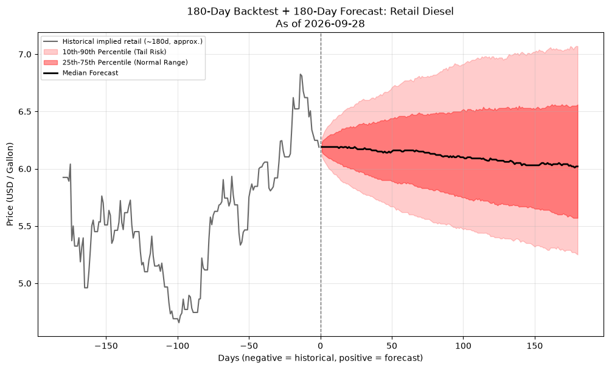

# petroleum-forecasting

Production petroleum stochastic forecast pipeline. The project calibrates a
price model from recent NYMEX futures data, runs parallel Monte Carlo
simulations, and generates forecast charts for retail gasoline and diesel.

## Files

- `calibrate.py` downloads crude, gasoline, and diesel futures data with
  `yfinance` and writes the model inputs to `params.json` and
  `params_macro.json`. It estimates three groups of inputs: today's spot state
  (crude price, crack spreads, jump-filtered volatility), the **forward
  curves** for CL/HO/RB that give the model its drift, and slow-moving
  structural dynamics (jump frequency and size, crack mean-reversion speed,
  crack volatility in $/bbl, crack seasonality) fitted to ten years of history.
- `simulate.go` reads those calibrations and simulates 2,000 180-day fuel
  paths by default (configurable via `sims` in `params_macro.json`). It
  anchors crude and both crack spreads to the forward curves, adds Merton
  jump-diffusion on crude, and layers sovereign production behavior, SPR
  intervention logic, chokepoint freight risk, and mean-reverting crack
  spreads on top. It also writes `anchor_path.csv`, the deterministic path the
  simulation is built around.
- `report_gen.py` reads the simulation CSVs and creates percentile-band charts:
  `gasoline_forecast.png` and `diesel_forecast.png` with the date stamped in the
  title. Each chart plots the **mean** and **median** forecast plus the market
  forward curve anchor, so the gap between them is visible rather than implied.
  Each chart also overlays a 180-day historical backtest before day 0,
  reconstructed from RBOB gasoline and heating-oil futures closes, so the
  forecast reads as a continuous 360-day window (180 back, 180 forward). This
  requires internet access the same as `calibrate.py`; if the historical fetch
  fails for any reason, the chart still renders with just the forecast half.
- `run_pipeline.bat` runs calibration, builds and runs the Go simulation,
  generates both charts, and refreshes the scenario what-if report. It publishes
  the report, forecast charts, and scenario charts to `main`, and stops if any
  step fails.
- `scenario_report.py` runs the simulator once per what-if scenario (Hormuz
  closure, Saudi production cut, Iran sanctions lifted, etc.), then writes a
  Bloomberg-style markdown report (`oil_market_outlook.md`) with scenario
  comparison charts and tables. Run it after `calibrate.py`; it restores
  `params_macro.json` and the standard result CSVs to the base case when it
  finishes, so it does not disturb the normal pipeline outputs. It also reads
  the current national average regular and diesel prices from AAA's public
  gas-prices page and shows them as a dated snapshot in the report. If AAA is
  unavailable or its table changes, report generation fails instead of
  publishing missing or stale retail prices.
- `.gitignore` excludes generated data outputs, the local virtual environment,
  and copied workspace artifacts.

## Requirements

- Windows (the included deployment script is a batch file)
- Python 3.10 or newer
- Go 1.20 or newer
- Internet access when calibration and report generation run, so `yfinance`
  can fetch NYMEX data and the report can read AAA's public gas-prices page

Install the Python dependencies in a virtual environment:

```powershell
py -3 -m venv .venv
.\\.venv\\Scripts\\Activate.ps1
python -m pip install --upgrade pip
python -m pip install numpy pandas matplotlib yfinance requests beautifulsoup4
```

If PowerShell blocks activation, run the commands from Command Prompt instead:

```bat
py -3 -m venv .venv
.venv\\Scripts\\activate.bat
python -m pip install --upgrade pip
python -m pip install numpy pandas matplotlib yfinance requests beautifulsoup4
```

## Run Locally

Run the batch file from the repository directory so all input and output files
are resolved in the expected location:

```bat
run_pipeline.bat
```

Or run the stages individually:

```bat
python calibrate.py
go build simulate.go
simulate.exe
python report_gen.py
python scenario_report.py
```

The default model uses 252 days of data for the responsive volatility
estimate, ten years for the structural estimates (jumps, crack reversion,
seasonality), the next ten contract months for the forward curves, a 180-day
forecast horizon, and 2,000 simulation paths (set by `sims` in
`params_macro.json`; omit it, or set it to 0, and `simulate.go` falls back to
the same 2,000-path default). Raise it for tighter tail percentiles at the
cost of longer run time, or lower it for faster iteration. Calibration must
run before simulation because `simulate.go` requires the generated
`params.json` file.

## Model Logic: How the Variables Interact

This project is a coupled system of stochastic equations that separates raw
commodity pricing from the real-world constraints that affect retail fuel
costs. The single most important thing to understand is where the model's
*direction* comes from, so that is section 1.

### 1. The market-implied anchor (`curve_crude`, `curve_crack_gas`,
`curve_crack_diesel`, `curve_drift_weight`)

A stochastic model has to get its sense of direction from somewhere. Estimating
a trend from recent price history is a bad way to do it — trailing momentum is
a poor predictor of forward oil prices, and extrapolating it would just encode
whatever the last few months happened to do.

Instead, the model reads the **forward curve**. `calibrate.py` pulls the next
ten CL, HO, and RB contract months and converts them into the path the market
itself expects crude and both crack spreads to follow:

- `curve_crude`: `[days_out, price]` pairs from the CL curve.
- `curve_crack_gas` / `curve_crack_diesel`: implied forward cracks, computed
  from same-maturity RB/HO and CL settlements.
- `curve_drift_weight`: how much of the curve's drift to apply. `1.0` follows
  it in full; lower it to discount the curve.

`simulate.go` interpolates these into a daily anchor path. Crude is anchored
multiplicatively (the curve's *shape* applied to today's spot) and the cracks
additively, since a spread is a difference and can sit near zero. Both are
pinned to today's observed value at day 0, so the anchor starts exactly where
the market is, and the curve is held flat beyond its quoted range rather than
extrapolated into a fabricated slope.

Two consequences worth internalizing:

- **The base case has no independent view.** The model's expected path *is*
  the market's. What the simulation adds is the distribution around it.
- **Futures are a risk-neutral expectation, not a forecast.** In
  backwardation the curve reads lower than a realized spot path typically
  turns out to be. Treat the level as market-implied, not predicted, and use
  `curve_drift_weight` if you want to discount it.

If the curve cannot be fetched, the model falls back to mean reversion toward
the fitted long-run crack level plus its seasonal cycle, and to a **flat**
crude anchor — no directional view at all, which is the honest answer when
there is no forward data to read one from.

### 2. Crude price component (`s0`, `sigma_crude`, `jump_lambda`, `jump_mu`,
`jump_sigma`)

- `s0`: the current crude price baseline.
- `sigma_crude`: diffusion volatility of crude returns. Estimated on an EWM of
  the last 252 days with jump days removed, so the jump component is not
  counted twice.
- `jump_lambda`: jump frequency per year, estimated by flagging daily log
  returns beyond 4 robust (MAD-scaled) standard deviations.
- `jump_mu` / `jump_sigma`: mean and dispersion of those jumps in log terms.

Crude follows Merton jump-diffusion: a lognormal diffusion around the anchor
path plus a compound Poisson jump. The jump term carries a **compensator**
(`-lambda * (e^(mu + sigma^2/2) - 1)`) so that adding jumps widens the
distribution without silently shifting the whole forecast off the curve it is
anchored to.

One statistical property to keep in mind when reading the charts: crude is
lognormal, so at high volatility the **median** drifts below the **mean** even
with zero drift. At `sigma_crude` near 0.45 that is roughly a 5% gap over 180
days. The charts plot both. The gap is a property of the distribution, not a
bearish view — which is why the median alone is a misleading headline.

### 3. Sovereign production and supply dynamics (`saudi_prod`, `saudi_cap`,
`saudi_response`, `russia_prod`, `russia_decay`, `venezuela_cap`, `iran_cap`,
`iran_prod`, `us_prod`, `us_cap`, `us_response`, `other_prod`, `other_cap`,
`other_response`)

The model treats supply as a constrained system instead of a perfect infinite
supply assumption.

Producers respond to **how far crude has strayed from the anchor path**, not to
its absolute level:

```
deviation = S_t - anchor(t)
saudiQ   += saudi_response * deviation * dt
```

This matters. The forward curve already prices in the supply response the
market expects, so charging for it a second time against a fixed dollar target
would manufacture a drift out of nothing more than a high spot price. Keying
the response to the deviation makes the supply block a genuine *stabilizer*:
it pushes back when price strays from the expected path and is silent when
price is on it. It also means these parameters never go stale, because the
anchor is recalibrated from the market every run.

- `saudi_prod` / `saudi_cap` / `saudi_floor` / `saudi_response`: Saudi Arabia
  acts as a balancing producer, adding output when crude runs above the
  anchor and pulling back below it.
- `russia_prod` / `russia_decay`: current output and a negative drift
  representing aging wells, sanctions exposure, and infrastructure decline.
  Russia does not respond to price.
- `us_prod` / `us_cap` / `us_floor` / `us_response`: US shale, the most
  price-responsive producer in the model, bounded by a high marginal-cost
  floor reflecting existing wells that aren't easily shut in.
- `other_prod` / `other_cap` / `other_response`: an aggregated "rest of world"
  baseline and ceiling, modeled as a slow-moving aggregate.
- `iran_prod` / `iran_cap` / `iran_drift_rate`: Iran is sanctions-constrained
  and barely responds to price. `iran_drift_rate` defaults to `0.0` (output
  holds flat); a sanctions-relief scenario sets it above zero so output ramps
  toward the new cap over the horizon.
- `venezuela_cap`: an export ceiling for Venezuela. (Not yet wired into the
  simulation's production dynamics — currently informational only.)

The net imbalance against the calibrated baseline feeds back into crude drift
at `SupplyPriceImpact` (0.1 annualized drift per 1 mb/d of imbalance).

### 4. Crack spreads: reversion, volatility, and seasonality
(`crack_gas_0`, `crack_diesel_0`, `crack_*_kappa`, `crack_*_theta`,
`sigma_crack_*_bbl`, `crack_*_seasonal_amp`, `crack_*_seasonal_phase`)

Gasoline and diesel do not move in a vacuum; their values depend on seasonal
refining yields and blending rules. The crack spread is frequently the
*dominant* term — a diesel crack near $95/bbl is $2.26 of a $6.10 pump price,
more than the crude itself.

Each crack is carried as **anchor plus a mean-reverting deviation**:

```
dev   += -kappa * dev * dt + sigma_bbl * sqrt(dt) * Z
crack  = anchor(t) + dev
```

Written this way the simulated spread tracks the anchor exactly in
expectation rather than lagging behind it, which matters because the forward
crack curve can move sharply (the RBOB curve steps up into summer-grade
season). The deviation is seeded with today's gap to the anchor, which makes
both modes fall out of the same expression: under a forward curve that gap is
zero, and in fallback mode it decays from today's level toward the long-run
one at the fitted speed.

- `crack_*_kappa` / `crack_*_theta`: reversion speed (per year) and long-run
  level ($/bbl), from an OLS fit of daily change on level over ten years.
- `sigma_crack_*_bbl`: crack volatility in **dollars per barrel per year**.
  The older `sigma_crack_gas` / `sigma_crack_diesel` fields were log-return
  volatilities of the *product* futures and were never in the right units to
  drive a spread, which is why they sat unused.
- `crack_*_seasonal_amp` / `_phase`: amplitude and phase of the annual cycle,
  fitted by sin/cos regression on the deviation from a centred one-year
  rolling mean. **Used only in fallback mode** — when a forward curve is
  available it already contains the seasonality, and applying both would
  double-count it.

Worth knowing what that fit actually says: gasoline crack seasonality is
strong and stable (amplitude around $9/bbl, peaking in early June, R² above
0.5 across 5/10/15-year windows), which is the summer driving season and RVP
blending rules. Diesel crack seasonality is weak (amplitude under $2/bbl, R²
about 0.02) — the heating-season effect is real but small and easily swamped
by supply shocks.

### 5. Freight and maritime chokepoint risk (`freight_0`,
`chokepoint_lambda`, `chokepoint_jump_mu`, `chokepoint_decay`, `hormuz_rate`,
`bab_rate`, `shipping_cost_0`)

The model separates shipping cost from the commodity itself because the freight
bill is driven by geopolitical risk rather than crude value alone.

- `freight_0`: the baseline tanker freight cost in dollars per barrel.
- `chokepoint_lambda`: the rate at which conflict-driven shipping disruptions are
  expected.
- `chokepoint_jump_mu`: the average extra freight cost added when shipping risk
  spikes.
- `chokepoint_decay`: how fast a disruption's supply effect fades (12.0 is a
  half-life of about 21 days). Without this a disruption would last a single
  simulation step and move crude by a few hundredths of a percent, making the
  whole chokepoint mechanism freight-only in practice.
- `hormuz_rate` / `bab_rate`: the daily oil volume (million barrels per day)
  that normally transits the Strait of Hormuz and Bab el-Mandeb. When a
  disruption event fires, the model picks a strait weighted by relative
  traffic and scales the *severity* of that event — the freight jump, the
  shipping cost jump, and a persistent supply shock all get bigger the busier
  the affected strait normally is.
- `shipping_cost_0`: the baseline war-risk/insurance premium in dollars per
  barrel. Unlike `freight_0`, which represents the physical tanker charter
  cost, `shipping_cost` represents insurance and war-risk surcharges layered
  on top of freight, and it reverts to baseline faster once a disruption
  passes.

### 6. SPR intervention logic (`spr_trigger_ratio`, `spr_floor_ratio`,
`spr_max_draw_mbpd`, `spr_level_mbbl`, `spr_capacity_mbbl`)

The Strategic Petroleum Reserve is modeled as a policy lever with a persistent,
depletable stock, not just an abstract damping term.

- `spr_trigger_ratio`: release threshold as a **multiple of the anchor path**
  (default 1.25).
- `spr_floor_ratio`: restock threshold, likewise relative (default 0.75).
- `spr_max_draw_mbpd`: the maximum release rate, in million barrels per day.
- `spr_level_mbbl`: the current reserve level, in million barrels. This is a
  manual estimate (not pulled live) that should be refreshed periodically from
  EIA/DOE reporting.
- `spr_capacity_mbbl`: the maximum reserve capacity, used to cap restocking.

These thresholds are ratios rather than absolute dollars on purpose.
"Unusually expensive crude" is only meaningful relative to what the market
already expects — an absolute trigger set near the prevailing spot price
fires on essentially every path and turns a contingent policy response into a
permanent drag on the forecast.

When crude spikes above the trigger, the model releases reserves at up to
`spr_max_draw_mbpd`, but never more than what remains in `spr_level_mbbl` — a
reserve that starts low can only prop up price for so long before it runs out
of barrels to draw on. Below the floor, restocking becomes a mild drain on
supply and rebuilds the level, up to `spr_capacity_mbbl`.

### 7. Interaction between variables

The model works by coupling the drivers like this:

1. The forward curves set the expected path for crude and both crack spreads.
2. Crude diffuses lognormally around that path, with compensated jumps.
3. Sovereign production responds to *deviation* from the path, damping moves
   away from it in either direction.
4. Crack spreads revert toward their own anchor at their fitted speed, with
   calibrated dollar volatility.
5. Freight and chokepoint risk add delivery cost and a persistent supply
   shock; the shipping insurance premium adds a second, faster-reverting cost
   spike on top of freight, both scaled by chokepoint throughput.
6. SPR intervention acts as a policy shock at the extremes of the price
   distribution.

The final pump price is not just the commodity price. It is the crude price path,
plus refining margin, plus freight, plus the shipping insurance premium, plus
taxes and distribution costs:

`P_t = (S_t + C_t + F_t + I_t) / 42 + D_t + T_t`

That is why a forecast can show lower fuel prices even when local gasoline at the
pump feels expensive today: the forecast is modeling the medium-term path of the
whole chain, not just the immediate station price you see in the moment.

## Outputs

After a successful run, the repository contains:

- `params.json`: legacy market calibration inputs
- `params_macro.json`: forward curves, sovereign supply, SPR, freight, crack,
  jump, and seasonal inputs
- `results_gas.csv`: one simulated gasoline path per row
- `results_diesel.csv`: one simulated diesel path per row
- `results_macro_gas.csv`: macro-factor gasoline simulations
- `results_macro_diesel.csv`: macro-factor diesel simulations
- `anchor_path.csv`: the deterministic curve-implied anchor (crude, both
  cracks, and both retail prices) that the simulation is built around
- `gasoline_forecast.png`: chart for the gasoline path with the as-of date
- `diesel_forecast.png`: chart for the diesel path with the as-of date

### Reading the forecast charts

Each chart carries three lines, and the difference between them is the point:

- **Market forward curve (anchor)** — what the CL/HO/RB curves imply.
- **Mean forecast** — the simulation's expected path. This sits essentially
  on the anchor; if it drifts away from it, the supply, freight, or SPR blocks
  are injecting a view, which is worth investigating.
- **Median forecast** — sits *below* the mean at longer horizons because
  crude is lognormal. That gap is distributional, not directional.

A falling median is therefore not automatically a bearish signal, and a
trailing uptrend in the historical overlay does not imply the forecast should
continue it: the forecast follows the forward curve, and the curve is
frequently in backwardation while spot has been rising.

### Diesel Forecast



`gasoline_forecast.png` and `diesel_forecast.png` are tracked in Git (for the
README embeds above); the CSV/JSON data files are ignored. Keep those locally
or publish them to the reporting location used by your operations process.

### Scenario / What-If Report

`python scenario_report.py` (already included as step 4 of
`run_pipeline.bat`, and runnable on its own after `calibrate.py`) produces a
Bloomberg-analyst-style outlook covering the base case plus six stress
scenarios — Hormuz closure, Hormuz de-risking, a 20% Saudi production cut,
Iran sanctions being lifted, a US shale surge, and a combined Hormuz+Saudi
tail-risk case:

- `oil_market_outlook.md`: the written report, with summary tables, a
  per-scenario breakdown, and a methodology section describing the
  elasticity assumption used to size production shocks.
- `scenario_gasoline_paths.png` / `scenario_diesel_paths.png`: median price
  paths per scenario over the base case's percentile bands. Adjacent
  scenarios alternate solid and dotted lines (in addition to color) so
  similarly-colored series stay distinguishable.
- `scenario_day180_ranking.png`: a day-180 median price ranking across
  scenarios.

These three chart files and the report are tracked in Git (unlike the daily
pipeline outputs above) since they represent a point-in-time analysis rather
than a disposable daily run.

## Deployment

1. Install Python, Go, and the Python dependencies on the target Windows
   machine.
2. Copy or clone this repository to a stable folder, such as
   `C:\\Apps\\petroleum-forecasting`.
3. Open a terminal in that folder, activate the virtual environment, and run
   `run_pipeline.bat` once to verify network access and permissions.
4. To run it automatically, create a Windows Task Scheduler task with:
   - **Program:** the full path to `run_pipeline.bat`
   - **Start in:** the repository folder
   - **Trigger:** the desired daily schedule, preferably after the market data
     is available
   - **Settings:** enable running whether or not a user is logged on, and save
     the task output or configure a failure notification

The task account must have write access to the repository folder. Because the
batch file calls `python`, `go`, and `git`, those commands must be on that
account's `PATH`; alternatively, update the batch file to use absolute paths
to the virtual-environment Python executable, the Go installation, and Git.

The final pipeline step commits and pushes `oil_market_outlook.md` and its
three chart PNGs straight to `main` if they changed since the last run (it
skips the commit if nothing changed). This requires the repository folder to
be checked out on `main` with push access already working non-interactively
— i.e. an SSH key loaded in an agent, or a credential helper with a cached
token — since a Task Scheduler run cannot prompt for a password. Test this by
running `run_pipeline.bat` manually first and confirming the push succeeds
without a prompt.

This repository does not currently expose an HTTP service or container image.
For server deployment, use the same scheduled batch workflow on a Windows
worker, or add a service wrapper that invokes `run_pipeline.bat` and publishes
the generated PNG and CSV files.

## Troubleshooting

- **`No return observations were available for calibration.`** Check the
  internet connection and confirm Yahoo Finance returned data for the three
  futures tickers.
- **`failed to open params.json`** Run `python calibrate.py` from the project
  directory before starting the simulation.
- **Missing Python module** Activate `.venv` and install the dependencies
  listed above.
- **Task Scheduler cannot find files** Set the task's **Start in** directory to
  the repository folder; relative paths are used throughout the pipeline.
