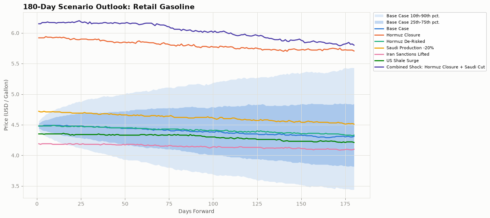
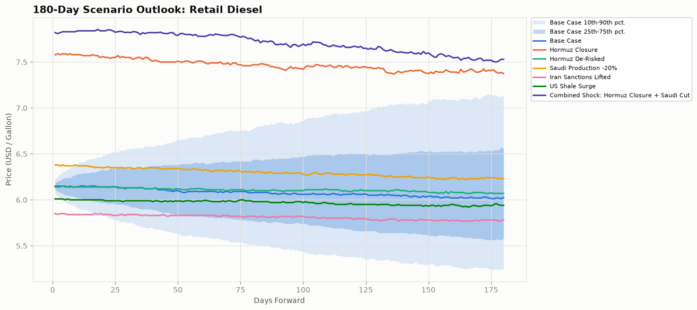
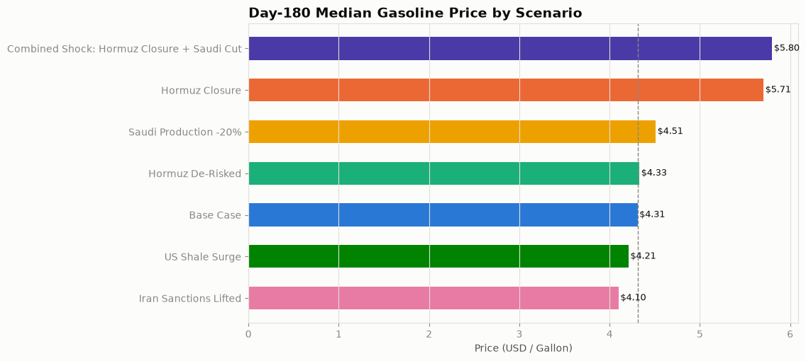

# Oil & Fuels Market Outlook - Scenario Analysis
*As of 2026-09-25 | 2,000-path Monte Carlo, 180-day horizon*

**AAA national average retail prices (2026-09-25):** Regular **$4.492/gal**, diesel **$6.502/gal** ([AAA Gas Prices](https://gasprices.aaa.com/)). These are a snapshot from the last report run, not live prices. This model projects a *medium-term path* for the crude-to-pump price chain, not today's station price, so some gap is expected — but if the gap looks large, check the "Calibration inputs" line under Methodology first: the model is only as current as the last `calibrate.py` run.

## Executive Summary

Under current calibrated conditions, the model's base-case median retail gasoline price reaches **$4.31/gal** 180 days out (10th-90th percentile range $3.44-$5.43). Across the six stress scenarios modeled below, the most bullish case is **Combined Shock: Hormuz Closure + Saudi Cut**, which pushes the day-180 median to $5.80/gal (+34.6% vs. base), while **Iran Sanctions Lifted** offers the most relief, at $4.10/gal (-4.9% vs. base).

## Scenario Summary Table (Gasoline)

| Scenario | Day 30 | Day 90 | Day 180 | Day 180 10th-90th pct. | vs. Base |
|---|---|---|---|---|---|
| Base Case | $4.47 | $4.39 | $4.31 | $3.44-$5.43 | - |
| Hormuz Closure | $5.89 | $5.78 | $5.71 | $4.17-$8.18 | +32.4% |
| Hormuz De-Risked | $4.47 | $4.42 | $4.33 | $3.53-$5.33 | +0.5% |
| Saudi Production -20% | $4.69 | $4.62 | $4.51 | $3.59-$5.78 | +4.6% |
| Iran Sanctions Lifted | $4.18 | $4.14 | $4.10 | $3.22-$5.11 | -4.9% |
| US Shale Surge | $4.34 | $4.32 | $4.21 | $3.37-$5.25 | -2.3% |
| Combined Shock: Hormuz Closure + Saudi Cut | $6.18 | $6.04 | $5.80 | $4.24-$8.46 | +34.6% |

## Scenario Summary Table (Diesel, Day 180 median)

| Scenario | Day 180 Diesel |
|---|---|
| Base Case | $6.03 |
| Hormuz Closure | $7.38 |
| Hormuz De-Risked | $6.07 |
| Saudi Production -20% | $6.23 |
| Iran Sanctions Lifted | $5.79 |
| US Shale Surge | $5.94 |
| Combined Shock: Hormuz Closure + Saudi Cut | $7.53 |

## Scenario Detail

### Base Case

Current calibrated market conditions; no policy or geopolitical shock applied.

Day-180 median: **$4.31/gal** gasoline (base case), $6.03/gal diesel.

### Hormuz Closure

Strait of Hormuz effectively shut: roughly 55% of its normal throughput is assumed offline, chokepoint disruption frequency quadruples, and the war-risk shipping premium triples.

Day-180 median: **$5.71/gal** gasoline (+32.4% vs. base), $7.38/gal diesel.

### Hormuz De-Risked

Geopolitical tension around the strait fully unwinds: disruption frequency falls to a fifth of baseline and the war-risk premium halves, with no direct change to physical supply.

Day-180 median: **$4.33/gal** gasoline (+0.5% vs. base), $6.07/gal diesel.

### Saudi Production -20%

Saudi Arabia cuts output and spare capacity by 20%, e.g. an OPEC+ supply-discipline shock.

Day-180 median: **$4.51/gal** gasoline (+4.6% vs. base), $6.23/gal diesel.

### Iran Sanctions Lifted

Sanctions are lifted, letting Iranian output ramp toward a materially higher production ceiling.

Day-180 median: **$4.10/gal** gasoline (-4.9% vs. base), $5.79/gal diesel.

### US Shale Surge

US shale operators ramp drilling activity, lifting both current output and spare capacity.

Day-180 median: **$4.21/gal** gasoline (-2.3% vs. base), $5.94/gal diesel.

### Combined Shock: Hormuz Closure + Saudi Cut

A simultaneous Hormuz closure and 20% Saudi production cut - a tail-risk stack of the two largest supply-side scenarios.

Day-180 median: **$5.80/gal** gasoline (+34.6% vs. base), $7.53/gal diesel.

## Charts

## Methodology

Each scenario re-runs the full 2,000-path stochastic simulation (`simulate.go`) with a modified set of inputs. Chokepoint scenarios (Hormuz closure/de-risking) adjust the model's existing disruption frequency and shipping-risk mechanics directly. Production scenarios additionally apply a first-order crude price shock: each 1% of global supply added or removed is assumed to move crude price 6% in the opposite direction (a simplifying short-run elasticity assumption, not a fitted econometric estimate), with volatility scaled up in proportion to shock size so tail scenarios carry wider, not just higher or lower, confidence bands. This is a model output for illustrative what-if analysis, not investment advice.

**Calibration inputs:** last calibrated on **2026-09-25** by `calibrate.py` from live NYMEX crude/gasoline/diesel futures (`yfinance`). If that date is stale, or reads "unknown" (no `date_calibrated` field), the base case below reflects old or placeholder inputs rather than today's market — re-run `python calibrate.py` before trusting the baseline.
